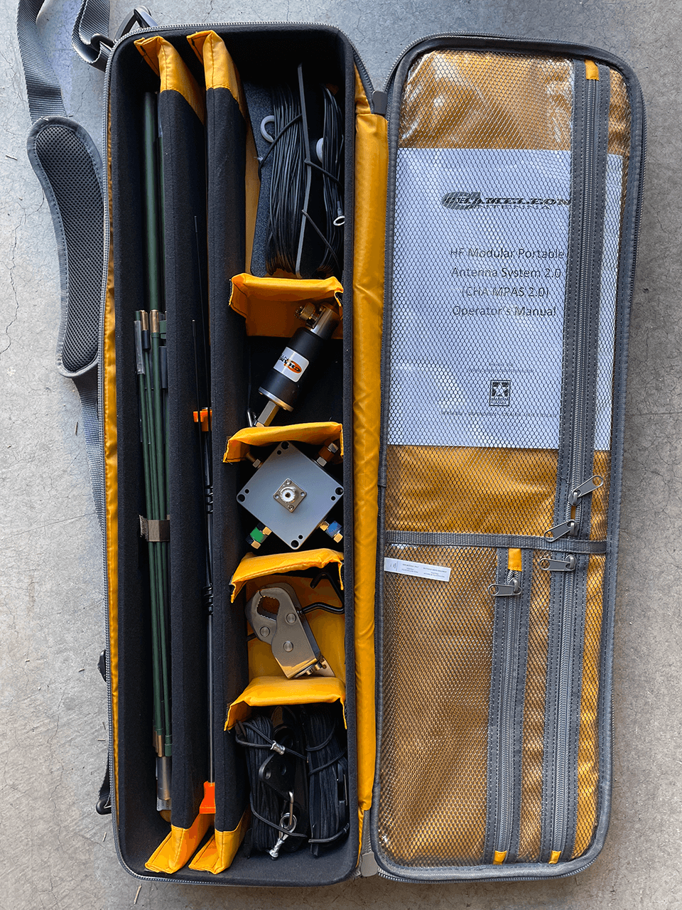

# The perfect Chameleon MPAS 2.0 case

> I found the perfect bag to store and transport Chameleon's MPAS 2.0 after a frustratingly long search

Chameleon Antennas sells a highly versatile and top quality [MPAS (modular portable antenna system) 2.0](https://chameleonantenna.com/shop-here/ols/products/cha-mpas-modular-portable-antenna-system-20) for ham radio. It can be configured as an end-fed, vertical, horizontal, inverted V or L, or NVIS antenna system capable of operating on 160-6 meters. It comes with folding poles and all of the hardware and cabling required to configure these and other configurations. They sell it with or without a backpack to carry all of the provided accessories, as well as those practically necessary for efficient field operations. The latter includes their [guying kit](https://chameleonantenna.com/shop-here/ols/products/cha-ugs), [jaw mount](https://chameleonantenna.com/shop-here/ols/products/cha-jawmount), and [counterpoises](https://chameleonantenna.com/shop-here/ols/products/cha-counterpoises-kit) (the MPAS 2.0 comes with a single wire counterpoise that I've found not as effective as four or more wire counterpoises). 

The backpack sold by Chameleon presumably swallows all of that gear -- except for the main poles. They're several inches longer than will fit inside the case, so you need to either strap them to the backpack or carry them separately. Chameleon doesn't sell a separate bag for the too-long poles. You can admittedly buy a [tent pole bag](https://www.amazon.com/Equinox-Tent-Pole-Bag-32-Inch/dp/B005U5I1K6/) long enough to hold them when folded, but I wanted an all-in-one solution that would pad *all* of the MPAS components. Moreover, I wanted something decently rugged, so that it would protect the MPAS in transit, easy to toss in the back of the truck, etc. 

It turns out that the main poles are just long enough to preclude fitting in them in every option I looked at. Hazard 4's [Takedown sling bag](https://hazard4.com/packs/sling-packs/takedown.html) would be a perfect solution, except that the main poles are slightly too long for it, too. A hard hit on either end might shatter the mast or damage the connectors on the end:

The MPAS 2.0 will fit in their larger [Smuggler bag](https://hazard4.com/smuggler.html), but I probably didn’t need that much volume and certainly did not want to pay $300 for it. 

I wasted more time searching for great solutions than anyone ever should. I was angry at Chameleon for offering a half-baked solution, but accept that they're a great antenna company, not a tactical gear shop. By accident I finally stumbled across the perfect solution: the [Cottonwood fly fishing rod and gear bag](https://byallen.com/cottonwood-fishing-rod-and-gear-bag-6369) from the Allen Company. The inner compartment is 30.5 inches long, just barely long enough to hold the main pole. It is as versatile as the Hazard 4 Takedown but also has configurable interior dividers. I've played around with a few configurations but the one pictured below works the best for me:

As you can see it holds all of the MPAS 2.0 components plus all of the essential add-ons mentioned above -- as well as their [dual-band VHF/UHF antenna](https://chameleonantenna.com/shop-here/ols/products/cha-db-vhf-uhf) — in a single bag. Not visible are the coax cable and extra counterpoises, which are stored in pockets on the front. The only thing that won’t fit is the [capacitance hat](https://chameleonantenna.com/shop-here/ols/products/cha-cap-hat), which when assembled is too large to fit into any bag. 

At $100 -- the price you'll pay with military/police/vet discount ordered direct from Allen or with taxes [from Amazon](https://www.amazon.com/Allen-Cottonwood-Fishing-Gear-fishing/dp/B00MK16O3O/) -- it's twice as expensive as the $50 pack Chameleon sells. But it's worth every penny of the extra cost. The ability to separate components with dividers rather than mixed all together in a rucksack is awesome. 

Now, if I could just get Allen to sell the Cottonwood bag with a [Kryptec Typhon](https://kryptek.com/kryptek-camo-patterns/typhon) fabric instead this would be a beyond perfect solution...